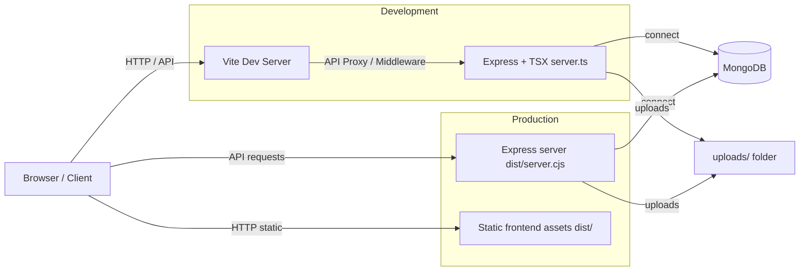
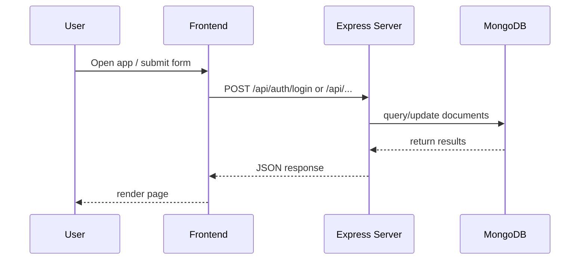

# Campus Placement Portal

A full-stack campus placement management system for students, recruiters, and administrators.This project uses a React + Vite frontend with Tailwind CSS, a Node/Express backend, MongoDB for persistence, and JWT authentication for secure role-based access.

---

## 🚀 Overview

The portal supports:

- Student profile management, job applications, job tracking, and notices
- Recruiter workflows for company management, applicant review, and job drive publishing
- Admin workflows for user management, notices, requests, and placement analytics
- File uploads for resumes and supporting documents
- Secure authentication and authorization by role

---

## 🧱 Architecture



### Request flow



---

## 📁 Project Structure

```text
./
  package.json
  tsconfig.json
  vite.config.ts
  server.ts
  README.md
  .env.example
  uploads/
  src/
    App.tsx
    main.tsx
    index.css
    types.ts
    components/
      auth/
      admin/
      recruiter/
      student/
      common/
    context/
  server/
    auth.ts
    db.ts
    models.ts
```

### Key directories

- `src/` — React frontend source code
- `src/components/` — UI components for each user role
- `src/context/` — authentication context and shared state
- `server/` — backend helpers, database connection, and model definitions
- `uploads/` — file upload storage for resumes and attachments

---

## 🔧 Technology Stack

- Frontend: React 19, Vite 6, Tailwind CSS 4
- Backend: Node.js, Express, Mongoose
- Database: MongoDB
- Auth: JWT with role-based access control
- File upload: multer
- TypeScript for end-to-end static typing

---

## ⚙️ Setup

### 1. Install dependencies

```bash
npm install
```

### 2. Configure environment variables

Copy `.env.example` to `.env` and update values:

```env
PORT=3000
MONGODB_URI=mongodb://127.0.0.1:27017/placement_portal
JWT_SECRET=your_super_secret_key
```

### 3. Run locally

```bash
npm run dev
```

This starts the development server with Vite and the Express backend powered by `tsx server.ts`.

---

## 🏗️ Build and Production

### Build frontend and backend bundle

```bash
npm run build
```

This command runs:

- `vite build` — builds the React frontend into `dist/`
- `esbuild server.ts ... --outfile=dist/server.cjs` — bundles the backend into a CommonJS server file

### Start production server

```bash
NODE_ENV=production npm start
```

The server will:

- serve static frontend assets from `dist/`
- reply to API routes under `/api/...`
- connect to MongoDB using `MONGODB_URI`
- create `uploads/` if missing

---

## 🧠 Backend Behavior

### Environment fallback

- `PORT` — optional, defaults to `3000`
- `MONGODB_URI` — required for production; falls back to `mongodb://127.0.0.1:27017/placement_portal` in development if missing
- `JWT_SECRET` — used for signing authentication tokens

### Express routes

The backend handles:

- authentication and user sessions
- notice publishing and deletion
- student, recruiter, and admin actions
- file uploads via multer
- static frontend serving in production

---

## 🧪 Scripts

- `npm run dev` — development mode with Vite middleware and hot reload
- `npm run build` — compile frontend and bundle backend server
- `npm start` — run production server from `dist/server.cjs`
- `npm run clean` — remove `dist/` and `server.js`
- `npm run lint` — run TypeScript compiler without emitting files

---

## 📌 Notes

- `.env` is intentionally excluded from source control; never commit secrets.
- `uploads/` stores resume and attachment files and should be backed up or moved to object storage in production.
- If deploying behind a reverse proxy or platform like Heroku, Vercel, or Railway, make sure the environment variables are configured and `NODE_ENV=production` is enabled.

---

## 💡 Troubleshooting

- If frontend TypeScript reports missing JSX types, verify `@types/react` and `@types/react-dom` are installed.
- If `npm run build` fails, ensure Node 20+ and MongoDB are installed or `MONGODB_URI` is valid.
- If uploads fail, check file permissions on the `uploads/` directory.

---

## 📘 Additional resources

- `src/types.ts` — application model interfaces
- `server/db.ts` — database connection and seed logic
- `server/models.ts` — Mongoose schemas
- `server.ts` — Express entrypoint and production/static serving logic
